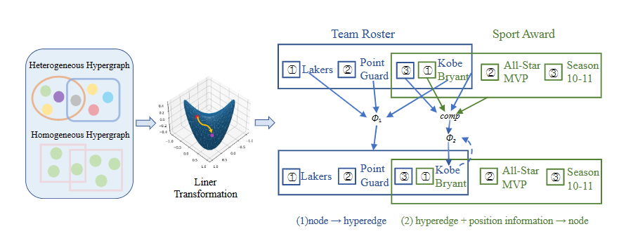

# A Unified Fully Hyperbolic Representation Learning on Hypergraph

Source code of the xxxx paper "A Unified Fully Hyperbolic Representation Learning on Hypergraph"


## Citation

## Dependencies

* `Python` version 3.7
* `Numpy` version 1.17
* `PyTorch` version 1.4.0
* `geoopt` version 0.3.1

## Usage
To train H2GNN you should define the parameters relevant to the given model.
The default values for most of these parameters are the ones that were used to obtain the results in the paper.

- `data`: data name (coauthorship/cocitation).

- `dataset`: dataset name (e.g.: cora/dblp for coauthorship, cora/citeseer/pubmed for cocitation).

- `add-self-loop`: add-self-loop to hypergraph.

- `nlayer`: number of hidden layers.

- `nhid`: number of hidden features, note that actually it's #nhid x #nhead.

- `nhead`: number of conv heads.

- `dropout`: dropout probability after UniConv layer.

- `lr`: learning rate.

- `wd`: weight decay.

- `epochs`: number of epochs to train.

 `-n-runs` number of runs for repeated experiments.

- `seed`: seed for randomness. 

- `patience`: early stop after specific epochs.

- `nostdout`: do not output logging to terminal.

- `split`: choose which train/test split to use.

- `out-dir`: output dir.


## Semi-supervised Hypernode Classification

```sh
bash run_dblp.sh 
```
## Inductive Learning on Evolving Hypergraphs

```sh
python train_evolving.py --data=coauthorship --dataset=dblp --nhid=8 --attn-drop=0.5 --wd=0.00005 --dropout=0.5 --manifold=Lorentz --c=2 --optimizer=Adam --nlayer=3
```

```


## License

Distributed under the MIT License. See `LICENSE` for more information.


