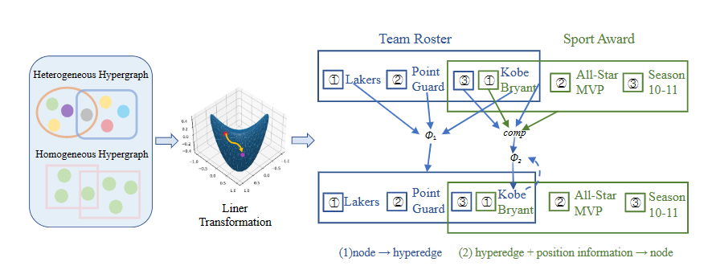

# A Unified Fully Hyperbolic Representation Learning on Hypergraph
Source code of the xxxx paper "A Unified Fully Hyperbolic Representation Learning on Hypergraph"




## Dependencies

* `Python` version 3.7
* `Numpy` version 1.17
* `PyTorch` version 1.4.0
* `geoopt` version 0.3.1

## Usage
To train H2GNN you should define the parameters relevant to the given model.
The default values for most of these parameters are the ones that were used to obtain the results in the paper.

- `dataset`: The dataset you want to run this model on.

- `batch_size`: The training batch size.

- `num_iterations`: The total number of training iterations.

- `lr`: The learning rate.

- `nr`: number of negative examples per positive example for each arity.

- `emb_dim`: embedding dimension.

- `input_drop`: drop out rate for input layer of all models.

- `hidden_drop`: drop out rate for hidden layer of all models.

- `no_test_by_arity`: when set, test results will not be saved by arity, but as a whole. This generally makes testing faster. 

- `test`: when set, this will test a trained model on the test dataset. If this option is present, then you must specify the path to a trained model using `-pretrained` argument.

- `pretrained`: the path to a pretrained model file. If this path exists, then the code will load a pretrained model before starting the train or test process.
The filename is expected to have the form `model_*.chkpnt`. The directory containing this file is expected to also contain the optimizer as `opt_*.chkpnt`, if training is to resume. 

- `output_dir`: the path to the output directory where the results and models will be saved. If left empty, then a directory will be automatically created.

- `restartable`: when set, the training job will be restartable: it will load the model from the last saved checkpoint in `output_dir`, as well as the `best_model`, and resume training from that point on.
If this option is set, you must also specify `output_dir`.


## Training
You can train by running the following commands:
```console
bash run_JF17K.sh
```
```console
python main.py -dataset JF17K -num_iterations 1000 -batch_size 128 -lr 0.01 -emb_dim 200 -nr 10
```

## Testing a pretrained model
You can test a pretrained model by running the following:
```console
python main.py -dataset JF17K -pretrained output/my_pretrained_model.chkpnt -test
```


## Cite 

If you use this package for published work, please cite the following paper:

Contact
=======


License
=======
